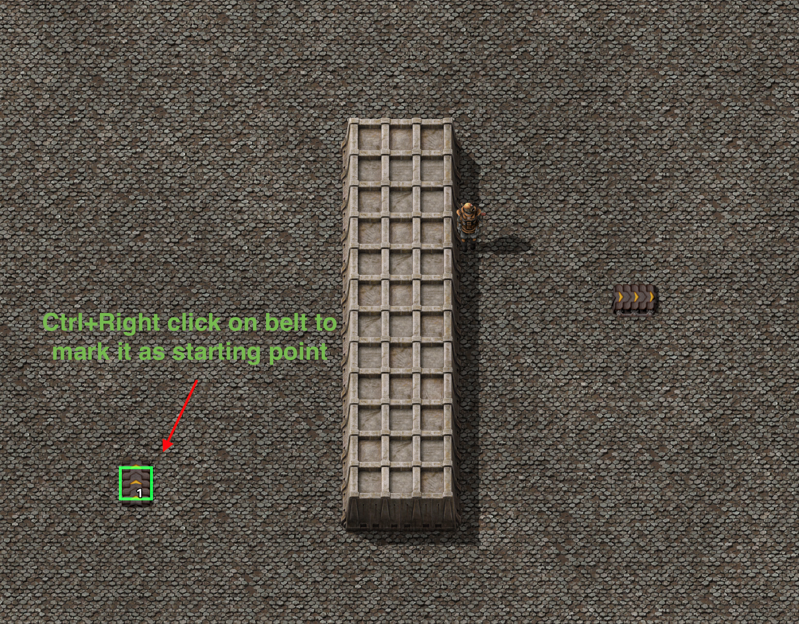
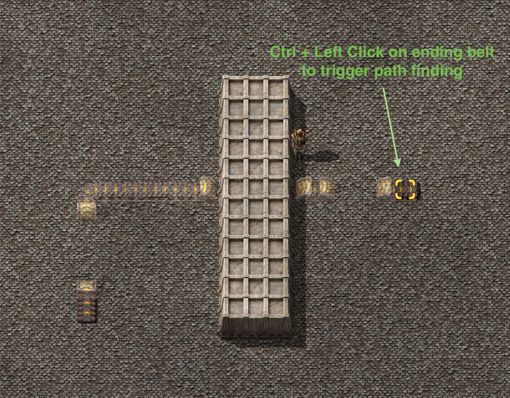
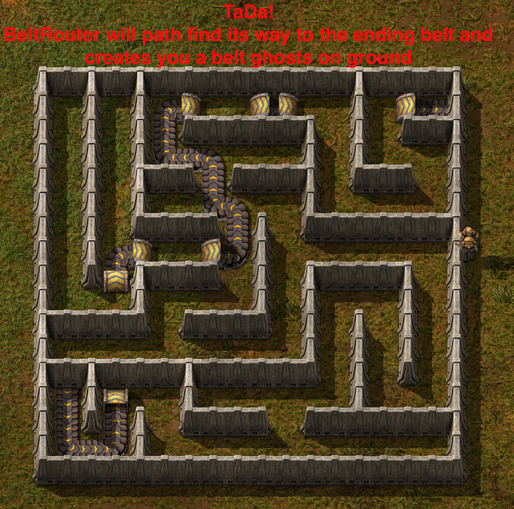
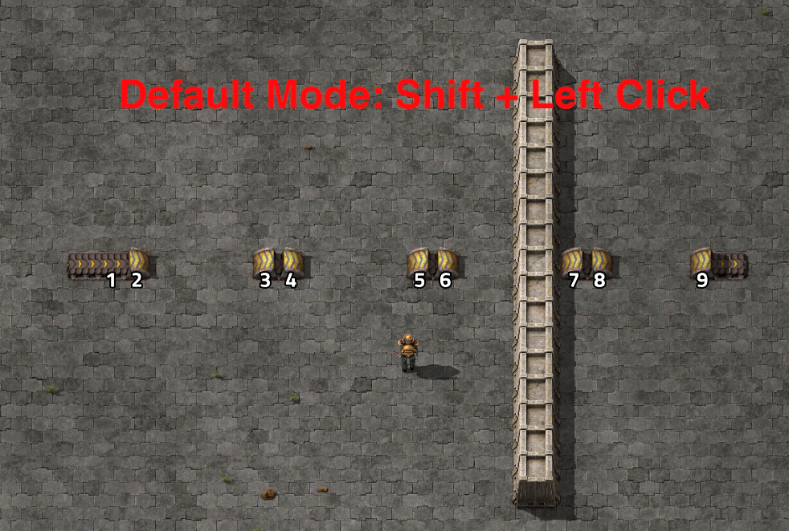
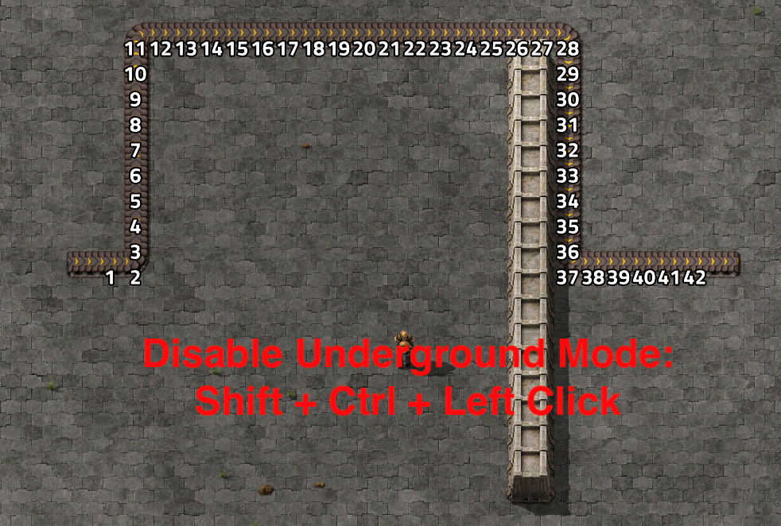
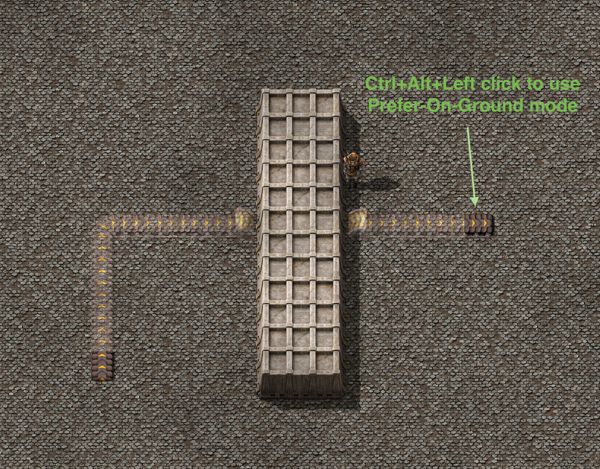
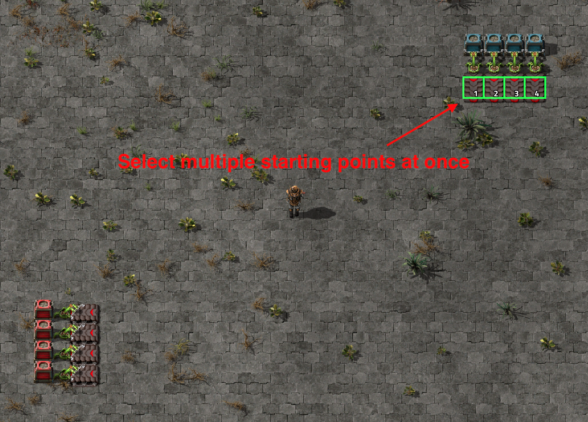
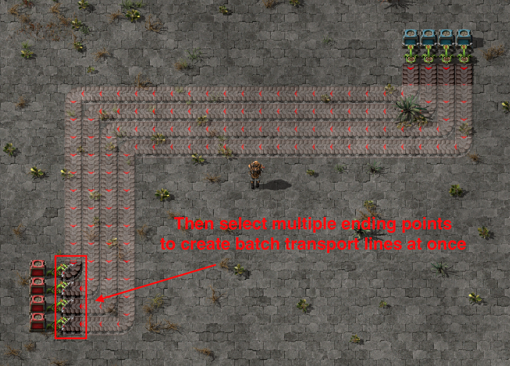

## Belt Router

BeltRouter helps you path-find belt routes from starting point (shift + right click) to ending point (shift + left click/shift + ctrl + left click) and creates a trail of belt ghosts.

## Key bindings

* "shift + right click" on starting belt to mark as transport line's starting point

* "shift + left click" on ending belt will allow path finder to put underground belts
  

* "shift + ctrl + left click" on ending belt will only allow above ground belts to exists
  

* "shift + alt + left click" on ending belt will only use underground belt if necessary (= if underground can save enough distance)
  

Above key bindings can always be changed via *Settings -> Controls -> Mods -> Belt Router*

## Additional Notes

* You can also select multiple belts at the same time:
  
  

* You can also increase path finding speed, or increase path finding max reach by going to *Mod settings -> Per player -> Belt Router*

* You can also route pipe with same operation. 

* Note that while most of the modded belts are supported, not many modded pipes are supported and trying to route them may create unexpected behavior. If you want a specific mod belt/pipe to be supported, please add a new thread in Discussion section.

Special thanks to @ChrislyBear for fixing bug about building belts may collides with entity ghosts, @F0x06, @RusselRaZe and @Xiomax for bug reporting, @slippycheeze for UI/algorithm suggestions!

I've spent hours implementing A* algorithm and Dijkstra algorithm for path finding. If you find this mod helpful, please give this project a star on my [github page](https://github.com/Seancheey/FactorioBeltRouter) :) 