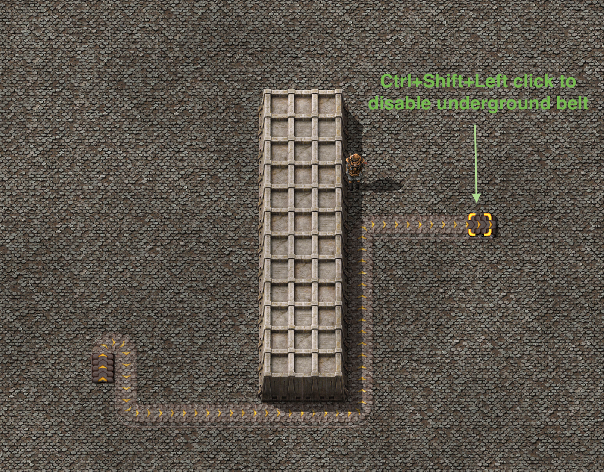

## Beta Preview for Belt Router

BeltRouter helps you path find belt routes from starting point (shift + right click) to ending point (shift + left click/shift + ctrl + left click) and creates a trail of belt ghosts.

## Key bindings

* "shift + right click" on starting belt to mark as transport line's starting point

* "shift + left click" on ending belt will allow path finder to put underground belts
  

* "shift + ctrl + left click" on ending belt will only allow above ground belts to exists
  

* "shift + alt + left click" on ending belt will only use underground belt if necessary (= if underground can save enough distance)
  

Above key bindings can always be changed via *Settings -> Controls -> Mods -> Belt Router*

## Additional Notes

* You can also select multiple belts at the same time: https://imgur.com/a/RixRxmr   https://imgur.com/a/aBp35yp

* You can also increase path finding speed, or increase path finding max reach by going to *Mod settings -> Per player -> Belt Router*

* You can also route pipe with same operation. 

* Note that while most of the modded belts are supported, not many modded pipes are supported and trying to route them may create unexpected behavior. If you want a specific mod belt/pipe to be supported, please add a new thread in Discussion section.

## TODO List

As title suggests, this mod is currently in beta preview, there are many bugs and caveats in the current version. Here lists my TODO list for the mod:

* TODO: Use two-way A* algorithm for early detecting unreachable condition and faster routing
* TODO: Fix bug that might makes path finder produce overlapping path for complex paths

Special thanks to @ChrislyBear for fixing bug about building belts may collides with entity ghosts, @F0x06 and @Xiomax for bug reporting!

I've spent hours implementing A* algorithm and Dijkstra algorithm for path finding. If you find this mod helpful, please give this project a star on my [github page](https://github.com/Seancheey/FactorioBeltRouter) :) 